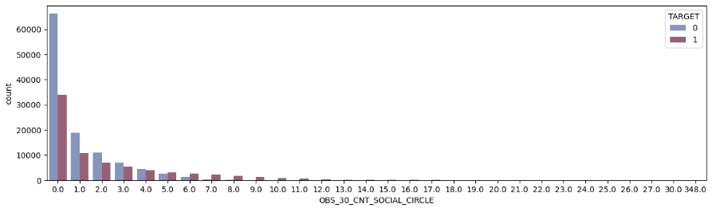

# 💳 Anomaly Detection for Credit Card Default prediction

**Identifying potential defaulters through anomaly detection modeling and derive their characteristics**

## 1. 🔍 Project Overview

| Item                                                                                                                                                                                                                                                                      | Description                                                        |
| -------------------------------------- | ------------------------------------------------------------------ |
| **Background**                         | Launched two years ago, this credit card has attracted around 300,000 customers. However, the high default rate has become a major concern. The credit card company aims to detect potential defaulters and analyse their traits using an anomaly detection system. |                                                                    |
| **Role**                                                                                                                                                                                                                                                                  | EDA & Data Preprocessing                                           |
| **Period**                                                                                                                                                                                                                                                                | Nov 16, 2023 – Nov 21, 2023                                        |
| **Team**                                                                                                                                                                                                                                                                  | 4 Members                                                          |

## 2. 🎯 Problem Statement
- **Analysis Subject**: 100,000 Initial customers with over 12 months of card usage record 
- **Prediction Subject**: Remaining 200,000 customers
- **Goal**:
  1. Predict customers with high-risk of default
  2. Identify key traits of them
  3. Suggest proactive strategies
 
## 3. 🗃️ Dataset Description
> *This project is a part of an activity at academic society BADA, and it is a fictional case study based on the [Home Credit Default Risk](https://www.kaggle.com/competitions/home-credit-default-risk) dataset from Kaggle. The data was used for non-commercial, academic purposes.*
- **Files used**: `application_train.csv`, `application_test.csv`
- **Key Features**: Default status(`TARGET`), gender, age, income, employment type, family status, contract type, etc.

## 4. 🛠 Tools & Libraries
- **Environment**: Python, Jupyter Notebook
- **Libraries**: Pandas, NumPy, Matplotlib, Seaborn, Scikit-learn, Tensorflow

## 5. 🧩 Modeling Workflow Summary

### 1) Data Preprocessing

- **Feature Removal**
    - **Overlapping Features**
        - `REGION_RATING_CLIENT_W_CITY`, `REG_CITY_NOT_LIVE_CITY`, `REG_CITY_NOT_WORK_CITY`, `LIVE_CITY_NOT_WORK_CITY`
    - **High multicollinearity**
        - `OBS_60_CNT_SOCIAL_CIRCLE`, `DEF_60_CNT_SOCIAL_CIRCLE`, `CNT_CHILDREN`
- **Handling Missing Values**
    - **Dropped features with over 50% missing values**
        - 47 features with normalized information about building where the client lives, `OWN_CAR_AGE`, `EXT_SOURCE_1`
    - Dropped `OCCUPATION_TYPE` due to complication with imputation
    - Use mode or median imputation for rest of the features
- **Categorical Feature Handling**
    - `ORGANIZATION_TYPE`: merged high-cardinality categories
    - One-Hot Encoding, Label Encoding
- **Normalization & Scaling**
    - Log-transformation to skewed features.
    - StandardScaler
  
### 2) Anomaly Detection Models

- Based on Accuracy and Recall, with higher importance on Recall due to imbalanced `TARGET` labels.

|  | OCSVM(ν= 0.1) | KNN(k = 300) | **PCA(n = 5)** | Auto Encoder |
| --- | --- | --- | --- | --- |
| Accuracy | 83.684% | 67.326 | **59.343%** | 19.353% |
| Recall | 11.491% | 33.385% | **45.911%** | 87.371% |

📌 Selected Model: **PCA**

- Good balance between Recall and Accuracy

### 3) Key Insights

- Total 75004 cases(40%) were flagged as potential defaulters.
- `AMT_REQ_CREDIT_BUREAU_YEAR`: Frequent enquiries to Credit Bureau ↑ → Default risk ↑
    
    ⇒ **Credit history might affect Default risk**
    
    
    
- `OBS_30_CNT_SOCIAL_CIRCLE`: Observable 30 DPD default ↑ → Default Risk ↑
    
    ⇒ **Sociall circle might affect Default risk**.
    
    
    
- `REGION_RATING_CLIENT`: Regional ratings ↓ → Default Risk ↑
    
    ⇒ **Vulnerability of the region might affect Default risk**
    
    
    
- `REGION_POPULATION_RELATIVE`: Normalized population > 0.04 → Default Risk ↑
    - Higer population is oftend relative to lower region ratings
    
    
    
- `CNT_FAM_MEMBERS`, `CNT_CHILDREN`: Family members ↑ → Default Risk ↑
    
    ⇒ **Heavier burden supporting dependents may affect repayment capacity**
    
    
    
- `REG_REGION_NOT_LIVE_REGION`, `REG_REGION_NOT_WORK_REGION`, `LIVE_REGION_NOT_WORK_REGION`: Mismatches in addresses → Default Risk ↑

## 6.💡 Conclusion

### Segment customers predicted as potential defaulters into "At-risk" and "High-risk" to minimise the loss

| Category | Condition | St |
| --- | --- | --- |
| **At-risk** | e.g. Number of enquiries to Credit Bureau ≥ 5 | Reduce credit limit 30% + Revaluation after 1 month |
| **High-risk** | e.g. Number of enquiries to Credit Bureau ≥ 7, Multiple default in social circle | Limit subscirption + Allow subscription after further analysation |

📌 **Expected impact**

- Reduce default rate
- Proactively reduce financial loss
- Potential of process automation and efficiency reinforcement by further model upgrade and real-time system developement

## 7. 🧠 Reflection

- I should think more thoroughly before excluding any features. Even though the variables have a lot of missing values, I should explore creative ways to utilise the variables and make them useful for enhancing model performance.
- It is necessary to examine the data and address what result would actually make sense. For example, according to the selected model, the higher the customers' income is, the higher the default risk grows, which doesn't match with reality. 
